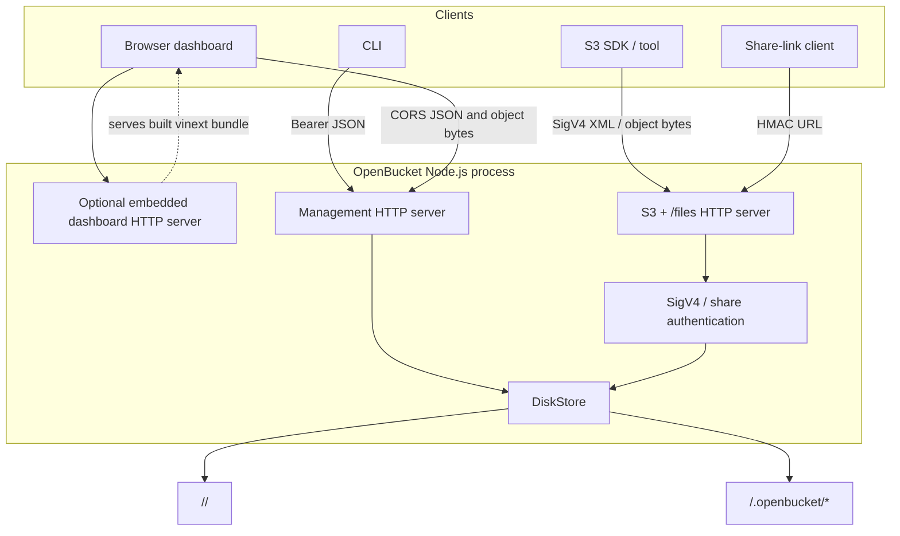
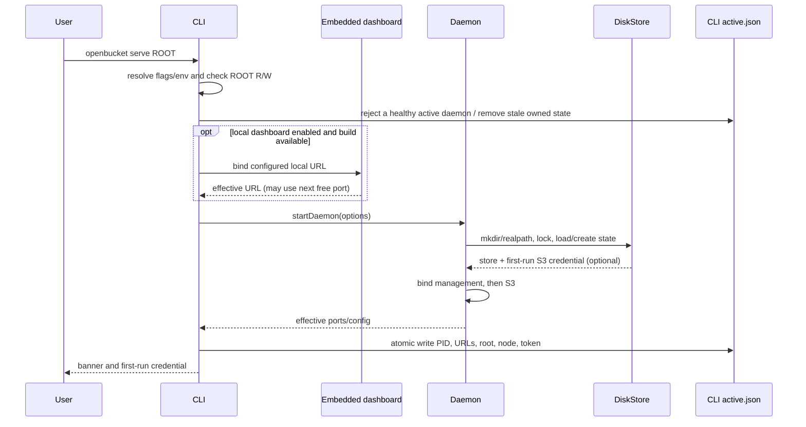
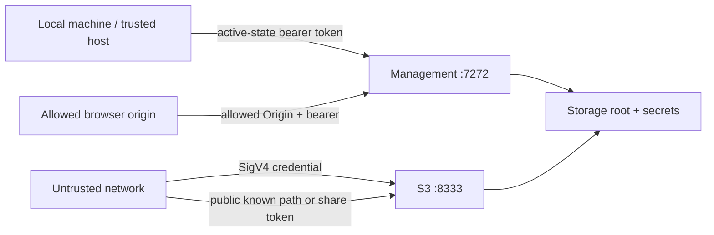

# OpenBucket architecture

This document describes the code in this repository, not a hypothetical hosted platform.

## System shape

OpenBucket is one storage process with three user-facing surfaces, one optional in-process dashboard server, and optional supervised `cloudflared` subprocesses:



The management and S3 listeners are independent Node HTTP servers. A slow or failed dashboard does not replace either API. They share a `DiskStore` instance, state, request logger, and shutdown lifecycle.

## Source ownership

| Component | Source | Responsibility |
| --- | --- | --- |
| CLI | `src/cli/main.ts` | Parse commands/env, manage active state, foreground/detached process, API client, doctor/output |
| Quick Tunnel supervisor | `src/cli/tunnel.ts` | Spawn `cloudflared` without a shell, validate published URLs, redact startup diagnostics, and terminate tunnel children |
| Daemon/router | `src/daemon/index.ts` | Start listeners, route management/S3/files requests, CORS, management auth, logging, errors |
| S3 signing | `src/daemon/auth.ts` | SigV4 canonicalization/signature verification, presigned expiry/skew, share HMAC |
| Disk store | `src/daemon/store.ts` | State, lock, validation, bucket/object I/O, credentials, logs, stats, multipart |
| Embedded dashboard server | `src/dashboard/server.ts` | Load built vinext worker/assets and serve a local HTTP URL from the daemon process |
| Dashboard client | `app/dashboard.tsx` | Live management API UI, connection storage, user actions, display normalization |
| Web build/runtime | vinext build output in `dist/client` and `dist/server` | Production dashboard rendering and assets |

## Startup flow



If the local dashboard URL uses an occupied port, the embedded server tries subsequent ports (up to its configured attempt limit) and the daemon adds the effective origin to CORS. If the dashboard build is absent or cannot start, the CLI warns and continues with management and S3 service.

The launch URL adds an `api` query parameter containing the connectable management URL. When startup or `openbucket dashboard` opens the browser, it also puts the management token in the URL **fragment** (which is not sent in the HTTP request). The dashboard validates the API URL, stores the URL in local storage, stores the token in API-scoped session storage, and removes query/fragment launch material from the address bar. The active-state/banner URL remains free of the token.

Detached mode starts the same CLI as a child with `--internal-foreground --no-open`, redirects ordinary stdout/stderr to the detached log, and polls `/healthz`. On first start, the child places the initial S3 credential temporarily in `active.json` but suppresses it from its own log banner. The parent prints the credential in the invoking terminal and atomically scrubs it from active state. A parent crash in that short handoff window can leave the temporary field, so the state directory remains a secret boundary.

With `--tunnel`, listener and dashboard startup happen first. The CLI then starts S3 and management Quick Tunnels concurrently and adds a dashboard tunnel only when the dashboard URL is local. It mutates the live advertised/share URL and exact CORS origins only after every required tunnel publishes a canonical HTTPS `trycloudflare.com` origin. Partial startup stops all published tunnels and the daemon. Active state retains local management/S3 URLs for CLI control plus the remote dashboard API/public S3 URLs for display and secure dashboard pairing.

## Listen addresses and advertised addresses

- Management defaults to `127.0.0.1:7272`.
- S3 defaults to `127.0.0.1:8333`.
- The embedded dashboard defaults to `http://localhost:3000` and accepts only local HTTP hostnames (`localhost`, `127.0.0.1`, or `::1`).
- `0.0.0.0`/`::` listener addresses are converted to loopback in returned/CLI connection URLs; wildcard addresses are listen targets, not connectable destinations.
- Port `0` asks the OS for an ephemeral API port.
- Outside Quick Tunnel mode, `OPENBUCKET_PUBLIC_BASE_URL` is advertised and used as the `/files` share-link root. It does not bind an interface or create a proxy.
- `--tunnel` keeps listeners on their configured local addresses and publishes separate temporary HTTPS origins through supervised `cloudflared` children. These origins are development endpoints, not a stable control plane.

The Docker deployment disables the embedded dashboard and runs a separate dashboard server so it can bind `0.0.0.0` inside its container.

## Trust boundaries



### Management boundary

`GET /healthz` is intentionally unauthenticated. Every `/v1/*` request must present `Authorization: Bearer <token>`; the daemon generates a token when none is supplied. The dashboard also sends `X-OpenBucket-Client: dashboard`, but that marker has no authentication authority.

The daemon returns CORS headers only for configured browser origins and rejects disallowed preflights. CORS does not protect non-browser access, so management should remain loopback/private and network-controlled even when a token exists. Avoid wildcard origins on an exposed listener.

### S3 boundary

Private operations require a valid SigV4 header or presigned query. The credential may constrain the bucket and/or deny non-`GET`/`HEAD` methods. Public buckets permit anonymous `GET`/`HEAD` only when a complete bucket and key are present; public listing is denied.

### Files boundary

`/files/<bucket>/<key>` accepts only `GET` and `HEAD` and requires a share HMAC bound to the bucket, key, and Unix expiry. The URL is a bearer secret.

### Filesystem boundary

Anyone who can read `.openbucket/state.json` can recover S3 secrets and the share-signing secret. Anyone who can write the storage root outside OpenBucket can change object bytes without an authenticated API request. Filesystem permissions and encryption are part of the security boundary.

## On-disk model

```text
storageRoot/
├── .openbucket/
│   ├── state.json
│   ├── requests.jsonl
│   ├── daemon.lock
│   ├── tmp/<uuid>.upload
│   └── multipart/<upload-id>/
│       ├── manifest.json
│       ├── <part-number>.part
│       └── <part-number>.etag
└── <bucket>/
    └── <object-key segments...>
```

### `state.json`

Schema version 1 contains:

```json
{
  "version": 1,
  "nodeId": "uuid",
  "nodeName": "display name",
  "createdAt": "ISO-8601",
  "shareSecret": "REDACTED",
  "buckets": {
    "photos": {
      "name": "photos",
      "createdAt": "ISO-8601",
      "public": false
    }
  },
  "credentials": [
    {
      "id": "uuid",
      "name": "default",
      "accessKeyId": "OB...",
      "secretAccessKey": "REDACTED",
      "createdAt": "ISO-8601",
      "readOnly": false
    }
  ]
}
```

State writes use a same-directory temporary file and rename. There is not yet a schema migration or repair framework. A malformed/unsupported state file fails startup instead of being silently replaced.

### Bucket/object mapping

A bucket is a valid directory immediately under the root. Existing top-level directories with safe S3-valid names are discovered as private buckets. Invalid directories remain untouched and invisible.

An object key maps to path segments inside its bucket. Keys must be 1-1024 UTF-8 bytes, cannot contain backslashes, NUL, empty/`.`/`..`/`.openbucket` segments, and must be representable safely on Windows. Existing symlink components are rejected. Object upload streams to `.openbucket/tmp`, verifies a declared SHA-256 when present, and renames into place.

ETags are MD5 hex digests of final bytes. Multipart completion concatenates selected parts and then computes a normal whole-object MD5; it does not use AWS's multipart ETag form.

### Lock

Opening a root creates `.openbucket/daemon.lock` exclusively with PID, hostname, process-instance ID, timestamp, and nonce. For a different PID on the same host, a lock is removed automatically only when that PID is demonstrably gone. For a reused current PID, the process-instance ID and in-process active-lock registry distinguish the live owner from a stale record. Malformed or other-host locks are retained conservatively. Graceful close removes only a lock with the matching nonce.

### Logs

`requests.jsonl` contains one JSON object per completed/closed request:

```json
{
  "timestamp": "ISO-8601",
  "requestId": "hex",
  "method": "GET",
  "path": "/bucket/key?X-Amz-Signature=%5BREDACTED%5D",
  "status": 200,
  "durationMs": 1.23,
  "bytesIn": 0,
  "bytesOut": 42,
  "ip": "127.0.0.1",
  "userAgent": "client",
  "accessKeyId": "OB...",
  "service": "s3"
}
```

`token` and `X-Amz-Signature` query values are redacted. Object paths, IPs, user agents, and access-key IDs remain visible. Logs are append-only but not tamper-proof and have no built-in rotation.

The detached process log is separate, normally `~/.openbucket/daemon.log`; it contains process banners and errors. Initial S3 credentials are deliberately suppressed there and use the short-lived, permission-restricted active-state handoff described in the startup flow.

## CLI active state

The CLI writes `active.json` under `OPENBUCKET_HOME` (default `~/.openbucket`):

```json
{
  "version": 1,
  "pid": 1234,
  "managementUrl": "http://127.0.0.1:7272",
  "s3Url": "http://127.0.0.1:8333",
  "dashboardUrl": "http://localhost:3000/?api=http%3A%2F%2F127.0.0.1%3A7272",
  "root": "/selected/root",
  "node": "display name",
  "token": "REDACTED",
  "startedAt": "ISO-8601"
}
```

This is a locator/session file, not the authoritative bucket catalog. Setting `OPENBUCKET_MANAGEMENT_URL` lets non-serve commands target an explicit management API without an active state file; provide `OPENBUCKET_ADMIN_TOKEN` when required.

## Request flows

### Management request

1. Create request ID and byte counters; attach completion logging.
2. Apply CORS response headers and handle `OPTIONS`.
3. Reject unsafe/reserved raw path segments.
4. Serve `/healthz`, then apply management auth for all remaining routes.
5. Parse a bounded JSON body where applicable (1 MiB; multipart completion uses 2 MiB on S3).
6. Call `DiskStore` and return JSON or bytes.
7. Convert known store/JSON/OS failures to structured JSON; unknown failures become `InternalError` without leaking internals.

### S3 request

1. Apply CORS/preflight, reject unsafe paths, add `x-amz-request-id`.
2. Route `/files` separately.
3. Parse path-style bucket/key.
4. Determine whether a known object in a public bucket may be anonymous.
5. Verify SigV4 and credential scope/mode.
6. Dispatch the supported bucket, list, multipart, copy, or object operation.
7. Return S3-shaped XML errors for failures.

### Dashboard request

1. Browser selects management URL: launch `api` hint, then saved local URL, then build-time default.
2. Browser sends `X-OpenBucket-Client: dashboard` plus the bearer token from API-scoped session storage.
3. Initial refresh fetches status, buckets, keys, newest logs, analytics, and client config concurrently.
4. Mutations call the same documented management endpoints and refresh live data.

## API boundaries

The management API is OpenBucket-specific and JSON-oriented. The S3 API is compatibility-oriented and XML/byte-stream oriented. Do not put operator-only actions on the S3 surface or make the dashboard read the filesystem directly.

The API contract is detailed in [API.md](API.md). S3 scope is detailed in [S3_COMPATIBILITY.md](S3_COMPATIBILITY.md).

## Concurrency and consistency

- State mutations are serialized in-process before atomic state save.
- Object uploads use unique temporary files and final rename; concurrent writes to the same key are last-completing-write wins and have no conditional-write protection.
- Bucket deletion without `force` checks for entries; direct external writers can race that check.
- Request-log appends are serialized in-process.
- Status uses stat-only bucket scans plus filesystem capacity; concurrent/cold results share a fixed five-second bucket cache. Object listing computes MD5 ETags once per observed size/mtime version and caches them in process. Analytics has a separate two-second aggregate cache. Very large cold scans can still be expensive.
- Direct file edits are visible on later reads/listings, but no watcher emits events and state does not version those edits.

OpenBucket provides single-process local consistency, not distributed consistency or transactions across data and metadata.

## Shutdown

`SIGINT`, `SIGTERM`, or `POST /v1/stop` initiates server close, waits for both HTTP listeners, flushes pending state/log mutations, closes/removes the owned lock, removes the matching CLI active state, stops any supervised Quick Tunnel subprocesses, and stops the embedded dashboard.

Abrupt termination can leave the lock, temporary upload files, or multipart directories. Same-host stale PID locks can be recovered automatically; cleanup of abandoned data is currently manual.

## Failure model

| Failure | Behavior |
| --- | --- |
| Storage path not writable | CLI start fails; API OS permission errors map to `AccessDenied`/403 |
| Disk full | API maps `ENOSPC` to `InsufficientStorage`/507 |
| Port occupied | Management/S3 start fails and opened resources close; embedded dashboard tries later local ports |
| Invalid state JSON/schema | Startup fails with `InvalidState`; state is not overwritten |
| Root already locked | Startup fails with `StorageRootInUse`/409 |
| Object upload hash mismatch | Temporary file is removed; destination is not installed |
| Broken client during response | Log may record 499 when response did not finish |
| Dashboard build/start failure | Warning; daemon and APIs continue |
| Unexpected router exception | JSON or S3 `InternalError`/500; internal message is not returned |
| Process crash/power loss | No automatic repair transaction; inspect lock/tmp/multipart/state and restore if needed |

Operational recovery is in [OPERATIONS.md](OPERATIONS.md); security consequences are in [SECURITY.md](SECURITY.md).
