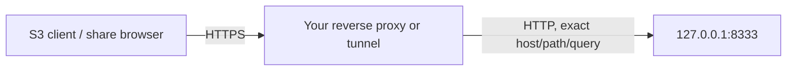

# Operating OpenBucket

This runbook covers a single OpenBucket node. It assumes the operator owns the host, selected storage, credentials, proxy, and backups.

## Service objectives you can claim

OpenBucket v0.1 can expose one writable filesystem root through one daemon process. It provides health, structured request errors, real request logs, and graceful shutdown. It does **not** provide replication, failover, an uptime SLA, automatic service installation, log rotation, or guaranteed crash recovery.

Set recovery objectives based on your underlying disk snapshots/backups—not on the presence of an S3 API.

## Requirements

- Node.js 22.13 or newer.
- A real directory the process account can read, write, rename, create directories in, and query filesystem capacity for.
- Free local ports, by default management `7272`, S3 `8333`, and dashboard `3000`.
- A synchronized system clock for SigV4.
- For temporary demo access: an installed `cloudflared`; for production remote access: an operator-managed firewall and named TLS reverse proxy/tunnel.

On a NAS or remote mount, validate atomic rename, exclusive-create locking, symlink behavior, capacity reporting, and failure semantics under the actual mount options. OpenBucket has no supported-filesystem certification matrix yet.

## Install and build

Source checkout:

```bash
npm ci
npm run build
npm run openbucket -- version
```

The full build is important: `openbucket serve` can load the production dashboard bundle from `dist/client` and `dist/server`.

Local global install:

```bash
npm pack
npm install --global ./openbucket-0.1.0.tgz
openbucket version
```

The npm `0.1.0` package is live. Pin the version on production hosts:

```bash
npm install --global openbucket@0.1.0
```

## Start modes

### Foreground

Use foreground mode under a terminal supervisor or service manager:

```bash
export OPENBUCKET_ADMIN_TOKEN="$(node -e "console.log(require('crypto').randomBytes(32).toString('base64url'))")"
openbucket serve /srv/openbucket --no-open
```

`SIGINT` and `SIGTERM` trigger graceful shutdown. The daemon stops accepting connections, closes both API servers, flushes pending state/log mutations, removes its owned root lock and CLI active state, and stops the embedded dashboard.

The repository does not install a systemd, launchd, or Windows service. A service unit you create should:

- run a non-root dedicated account;
- set an absolute storage root and `OPENBUCKET_HOME`;
- load the admin token from a protected secret/environment file;
- execute foreground `openbucket serve ... --no-open`;
- send `SIGTERM` and allow a shutdown timeout;
- restart on failure only after avoiding a tight crash loop;
- set explicit working directory and log destination.

### Detached CLI process

```bash
openbucket serve /srv/openbucket --detach --no-open
openbucket dashboard
openbucket status
openbucket logs --limit 50
openbucket stop
```

Detached mode is process detachment, not OS service registration. It does not start after reboot or provide an external restart policy. The child stdout/stderr goes to `OPENBUCKET_LOG_FILE` (default `~/.openbucket/daemon.log`). The child suppresses first-run S3 credentials from that banner; the credential passes temporarily through protected `active.json` until the parent prints and scrubs it.

The parent waits up to `OPENBUCKET_START_TIMEOUT_MS` (default 15000 ms) for `/healthz`. On failure, inspect the detached log.

### Embedded dashboard

When `OPENBUCKET_SERVE_DASHBOARD` is true (default), the dashboard URL is local HTTP, and the production bundle exists, the daemon also serves the dashboard. The default is `http://localhost:3000`.

If the port is occupied, the embedded server tries later ports and reports the effective URL. The launch URL includes a management `api` hint; automatic browser launch also carries the management token in a URL fragment for immediate API-scoped session pairing. `openbucket dashboard` repeats that safe open/re-pair flow after confirming the active daemon is healthy, without printing the token. If bundle loading fails, the daemon logs a warning and continues without the dashboard.

Disable embedded hosting for an independently run dashboard:

```bash
OPENBUCKET_SERVE_DASHBOARD=false openbucket serve /srv/openbucket --no-open
npm start -- --hostname 0.0.0.0 --port 3000
```

Set `OPENBUCKET_DASHBOARD_URL` to the origin users actually open so the daemon configures the correct CORS trust. Add only exact extra origins with `OPENBUCKET_ALLOWED_ORIGINS`.

### Vercel-hosted dashboard

The Vercel `/dashboard` requires a MongoDB-backed session and reads registered nodes, heartbeat/storage summaries, aggregate usage, and admin totals. Object bytes and daemon/S3 secrets never enter MongoDB. Its **Live node** view is a separate direct browser client: configure exact CORS, independently protect management, and enter its bearer in the dialog. Explicit `--offline` development remains local and unregistered. See [Hosting the web application](VERCEL.md).

## Docker Compose

Prepare configuration:

```bash
cp .env.example .env
node -e "console.log(require('crypto').randomBytes(32).toString('base64url'))"
# Put that result in .env as OPENBUCKET_ADMIN_TOKEN.
# Keep OPENBUCKET_TUNNEL=false unless the image deliberately includes cloudflared.
docker compose config
docker compose build daemon
docker compose run --rm daemon login --email owner@example.com
docker compose up --build -d
docker compose ps
```

The login command uses a hidden prompt and mounts `openbucket-state` at `/state`, so its account session persists after the one-off container is removed. The daemon stores its node credential in the same volume. Never replace it with an anonymous `/state` mount. Set `OPENBUCKET_PUBLIC_BASE_URL` only after provisioning a managed S3 route; the standard image has no `cloudflared`, and Quick Tunnel remains development-only in custom images.

Open the dashboard and enter the exact `OPENBUCKET_ADMIN_TOKEN` from `.env` in Connection settings. The secret is intentionally not injected into the dashboard image/container; it stays in the browser's API-scoped session storage after entry.

The container profile sets `OPENBUCKET_SHOW_INITIAL_CREDENTIALS=false`, so the bootstrap S3 secret is not retained by the Docker logging driver. Create a workload key from the dashboard, or print a new key once in the current operator terminal:

```bash
docker compose exec daemon node dist/cli/main.js key create --name first-workload
```

Key creation returns the secret once. Store it securely, then create a replacement before revoking any key; the daemon refuses to revoke the final credential.

Compose runs:

- `daemon`: compiled CLI/daemon as unprivileged `node`, embedded dashboard disabled;
- `dashboard`: production vinext server on container port 3000;
- `openbucket-data`: default object/state-root named volume;
- `openbucket-state`: persistent account session, node credential, CLI active state, and detached log mounted at `/state`.

Host ports bind to `127.0.0.1` by default. `OPENBUCKET_DOCKER_BIND_HOST=0.0.0.0` expands exposure and must be paired with network controls.

Use a host bind for directly inspectable object bytes:

```dotenv
OPENBUCKET_STORAGE_MOUNT=./openbucket-data
```

or on Windows:

```dotenv
OPENBUCKET_STORAGE_MOUNT=C:/OpenBucket/data
```

After changing dashboard API URL, app URL, or ports, rebuild the dashboard because `NEXT_PUBLIC_*` values are embedded at build time:

```bash
docker compose build --no-cache dashboard
docker compose up -d
```

Run CLI commands inside the daemon container, where `/state/active.json` is available:

```bash
docker compose exec daemon node dist/cli/main.js status
docker compose exec daemon node dist/cli/main.js buckets
docker compose exec daemon node dist/cli/main.js logs --limit 20
```

To stop cleanly:

```bash
docker compose stop
```

`docker compose down` removes containers/network but retains declared named volumes unless `--volumes` is explicitly supplied. Treat `down --volumes` as destructive.

## Configuration precedence

For `serve`:

1. command flags/directory;
2. specific environment variables;
3. compatibility aliases/shared host;
4. built-in defaults.

Examples:

- `--host` overrides both specific listen-host variables;
- `OPENBUCKET_MANAGEMENT_HOST` and `OPENBUCKET_S3_HOST` override `OPENBUCKET_HOST` when there is no flag;
- `OPENBUCKET_NODE_NAME` overrides `OPENBUCKET_NAME`;
- `OPENBUCKET_PUBLIC_BASE_URL` overrides `OPENBUCKET_PUBLIC_URL`;
- `--tunnel` overrides `OPENBUCKET_TUNNEL`; Quick Tunnel mode rejects a manually advertised public base URL;
- `OPENBUCKET_ADMIN_TOKEN` overrides `OPENBUCKET_TOKEN`;
- `OPENBUCKET_HOME` overrides `OPENBUCKET_STATE_DIR`.

Relative storage roots resolve under the process working directory. Relative `OPENBUCKET_HOME` resolves under the OS user home. Relative `OPENBUCKET_LOG_FILE` resolves under the process working directory.

The CLI does not automatically load a `.env` file. Export values through the shell/service manager. Compose loads `.env` for interpolation.

## Health and readiness

Probe:

```bash
curl -fsS http://127.0.0.1:7272/healthz
```

Example response:

```json
{
  "ok": true,
  "status": "healthy",
  "version": "0.1.0",
  "nodeId": "uuid",
  "uptimeSeconds": 120
}
```

`/healthz` is unauthenticated and proves the management server and store started. It does not write/read a probe object, verify proxy reachability, test backup, or guarantee free disk.

For a deeper authenticated check:

```bash
openbucket status --json
openbucket doctor /srv/openbucket
```

`doctor` checks Node version, storage read/write with a temporary probe, daemon health, S3 TCP reachability, or listener availability when stopped. It does not validate an S3 signed round trip.

Suggested monitoring:

- `/healthz` response and process/container restart count;
- `availableBytes`, total `filesystemUsedBytes`, and OpenBucket `usedBytes` from `/v1/status`;
- errors and latency from `/v1/analytics`;
- HTTP 5xx/507/403 rates in `requests.jsonl`;
- age/size of `.openbucket/tmp` and `.openbucket/multipart`;
- root and detached-log disk consumption;
- backup success and periodic restore verification;
- certificate/tunnel health at the proxy.

Cold status calls recursively inspect object file metadata, and cold analytics calls scan the request log. The daemon shares bucket totals for five seconds and analytics for two seconds, but aggressive probing can still be expensive on very large stores.

## Logs

### Request log

Location: `<storage-root>/.openbucket/requests.jsonl`.

CLI:

```bash
openbucket logs --limit 100
openbucket logs --follow
```

The logger redacts `token` and `X-Amz-Signature` query values, but retains object paths, IPs, user agents, access-key IDs, sizes, status, and timing. The file is not immutable and has no rotation.

### Detached lifecycle log

Location: `OPENBUCKET_LOG_FILE` or `~/.openbucket/daemon.log`.

This is raw process stdout/stderr. The current detached handoff suppresses the first-run S3 secret from the child banner, but the log can still reveal paths and operational details. It has no rotation.

For both logs, use OS/container rotation only while accounting for open file handles. The safest v0.1 rotation is a clean stop, archive/truncate according to policy, and restart. Test any copy-truncate strategy before relying on it.

## Backup

The backup unit is the **entire storage root**, including `.openbucket`. Backing up only bucket directories loses node identity, public flags, S3 credentials, share-secret continuity, and logs. Backing up only `state.json` loses objects.

### Consistent offline backup

1. Stop clients or put the application into maintenance.
2. Run `openbucket stop` or stop the container/service.
3. Confirm `/healthz` is unavailable and no OpenBucket process uses the root.
4. Confirm graceful shutdown removed `.openbucket/daemon.lock`.
5. Snapshot/copy the entire root with permissions and timestamps as required.
6. Encrypt and checksum the backup.
7. Restart the daemon.
8. Periodically restore into an isolated path and perform signed list/get checks.

### Storage snapshot

An atomic filesystem/ZFS/LVM/storage-appliance snapshot can reduce downtime if it captures all bucket data and `.openbucket` in one consistency boundary. File-by-file live copies can pair old state with new objects or partial uploads and are not considered consistent.

The CLI state directory is useful to an active local session but is not required to restore node identity. Back it up only if your operational policy needs it; it contains the management token and stale PID/URL data should not be activated on another host.

## Restore

1. Install the same OpenBucket version first.
2. Restore the entire storage root to an isolated path with restrictive permissions.
3. Ensure no active daemon uses it.
4. Remove a restored `daemon.lock` only after proving it is not owned by a live process; graceful offline backups should not contain one.
5. Start on loopback with explicit alternate ports if testing beside production:

   ```bash
   openbucket serve /restore/openbucket \
     --management-port 17272 --s3-port 18333 \
     --dashboard-url http://localhost:13000 --no-open
   ```

6. Verify node ID/name, bucket/object counts, several object hashes, S3 authentication, public flags, scoped keys, and share-link policy.
7. Stop the test node before promoting the restored root.

If startup reports `InvalidState`, do not replace or hand-edit state in place. Preserve the failed root, collect a redacted copy/error, and restore a known-good backup. v0.1 has no supported repair/migration tool.

## Upgrade and rollback

Before every upgrade:

- read release notes and S3/config compatibility changes;
- run current `openbucket doctor`;
- stop cleanly and make a tested backup/snapshot;
- record current package/image digest and Node version;
- stage the new version against a restored copy when data is important.

Source/global package:

```bash
npm ci
npm run build
npm test
# install the packed artifact only after checks pass
npm pack
npm install --global ./openbucket-<version>.tgz
```

Docker:

```bash
docker compose build --pull
docker compose up -d
docker compose ps
```

Rollback is reinstalling the recorded prior package/image and restoring the pre-upgrade root if a release changed state. There is no formal migration/downgrade framework in v0.1, so never assume a newer state is backward-compatible.

## Credential rotation

S3 key rotation:

```bash
openbucket key create --name replacement
# Update and verify clients.
openbucket keys
openbucket key revoke <old-id>
```

The final S3 key cannot be revoked. Secrets are returned only on creation through API/CLI UI, although they remain stored in protected node state.

Management token rotation:

1. stop the daemon;
2. replace `OPENBUCKET_ADMIN_TOKEN` in the service secret/environment;
3. start the daemon;
4. update remote CLI/dashboard sessions;
5. invalidate/remove old active state on clients if applicable.

Individual share links cannot be revoked directly. Delete/rename the object, wait for expiry, or rotate the node share secret through a future supported workflow. Do not edit state manually.

## Reverse proxy or Cloudflare Tunnel

### Supervised Quick Tunnel (development/demo)

Install `cloudflared`, log in, then run:

```bash
openbucket login --email owner@example.com
openbucket serve /srv/openbucket --name demo-node --detach
```

Authenticated `serve` defaults to an S3-only Quick Tunnel when no managed public URL exists. `OPENBUCKET_TUNNEL=quick`/`--tunnel` requests it explicitly; `false`/`--no-tunnel` disables it. Offline explicit-tunnel demos also publish management and a local dashboard. All supervised children stop with the daemon.

Quick Tunnels have random restart-dependent URLs and are not production infrastructure or an SLA endpoint. If `cloudflared` exits, local storage remains online and a restart is required for a new public URL.

### Stable production proxy or named tunnel

The production model remains operator-owned:



For an ordinary reverse proxy:

- route a dedicated storage hostname to `http://127.0.0.1:8333`;
- preserve `Host`, method, path, query, and signed `x-amz-*` headers;
- do not normalize/rewrite encoded object paths or query order/values in a way that breaks SigV4;
- permit streaming request/response bodies, ranges, and workload-sized uploads;
- set TLS, timeouts, connection and rate limits;
- redact share tokens and S3 signatures in proxy access logs;
- do not route the management port on the public hostname.

Example nginx shape (adapt and test; certificate provisioning is external):

```nginx
server {
    listen 443 ssl;
    server_name storage.example.com;

    client_max_body_size 0;
    proxy_request_buffering off;
    proxy_buffering off;

    location / {
        proxy_set_header Host $http_host;
        proxy_set_header X-Forwarded-Proto https;
        proxy_pass http://127.0.0.1:8333;
    }
}
```

For Cloudflare Tunnel, create and operate a named tunnel in your Cloudflare account that maps a stable storage hostname to `http://127.0.0.1:8333`. Follow current Cloudflare documentation for authentication, DNS routing, ingress configuration, upload limits, and service operation. Protect any separately routed management hostname with both the OpenBucket bearer and an independent Cloudflare Access/network policy.

After route/TLS provisioning, log in and advertise it:

```bash
openbucket login --email owner@example.com
OPENBUCKET_PUBLIC_BASE_URL=https://s3.example.com \
  openbucket serve /srv/openbucket --name production-node --no-tunnel
```

This reports a managed endpoint in status/discovery and new share links. It does not verify or provision the proxy. `/<node-name>` is a locator only. Server-only `OPENBUCKET_NODE_DOMAIN` controls future hostnames but also provisions nothing.

For standalone local development, `--offline` disables registration, metering, discovery, and automatic tunneling.

Test:

- signed list/put/get/delete using the public endpoint;
- encoded keys and duplicate query values;
- byte ranges;
- large and multipart uploads;
- share links and expiry;
- proxy logging/redaction and behavior during upstream restart.

## Capacity and performance

OpenBucket reads the filesystem directly:

- object listing walks every file in a bucket and computes an MD5 ETag the first time a size/mtime version is seen; unchanged ETags are cached in process;
- status walks bucket/object metadata without hashing, requests filesystem capacity, and shares bucket totals for five seconds;
- analytics scans the full JSONL request log on a cold call and shares the aggregate for two seconds;
- recent-log reads currently load the log file before slicing.

Large object counts or logs can make control-plane calls slow and CPU/I/O intensive. Avoid polling the dashboard/status at high frequency. Benchmark on representative hardware and namespace size. Keep enough free space for the largest concurrent upload/multipart set because temporary and final bytes can coexist during commit.

There is no quota or automatic multipart/temp/log cleanup. Monitor and plan manual maintenance windows.

## Troubleshooting

### “Dashboard server unavailable”

- Run `npm run build` (or at least build web then CLI) from source.
- Confirm `dist/client` and `dist/server/index.js` exist in the installed artifact.
- Confirm the configured dashboard URL is local `http://localhost`, `127.0.0.1`, or `::1`.
- If using a separate dashboard, set `OPENBUCKET_SERVE_DASHBOARD=false`.

The APIs remain operational when embedded dashboard startup fails.

### `OpenBucket is already running`

Run `openbucket status`. If healthy, stop or use the existing node. If the active state points to an unreachable PID/URL, the CLI removes only state it can treat as stale; inspect `OPENBUCKET_HOME/active.json` before manual intervention.

### `StorageRootInUse`

Another daemon owns `.openbucket/daemon.lock`, or a crash left a conservative lock. Verify no local/remote-host process uses the root. On shared storage, check the hostname and PID in the lock. Remove it only after proving it is stale; deleting a live lock can permit two writers.

### `EADDRINUSE`

Management/S3 ports do not automatically shift. Find the owner or configure different ports. The embedded dashboard alone can shift to later ports.

### `InvalidState`

Stop, preserve the root, validate storage integrity, and restore a known-good full-root backup. Do not let tooling generate a new state over existing data.

### HTTP 401 management

Use `Authorization: Bearer $OPENBUCKET_ADMIN_TOKEN`, point the CLI at the matching active state, or enter the token in the dashboard session. Confirm token aliases/precedence and proxy header forwarding.

### HTTP 403 management/CORS

An unlisted browser origin cannot complete preflight. Set the exact dashboard origin, including scheme and port. This does not replace bearer/network authentication.

### S3 `SignatureDoesNotMatch`

- use path-style addressing;
- set region to a lowercase value such as `auto` or `us-east-1` consistently;
- synchronize client/server clocks;
- preserve host/path/query/headers at the proxy;
- avoid unsupported streaming/chunked signing;
- ensure credentials have no whitespace/newline changes.

### S3 `AccessDenied`

Check private/public behavior, read-only mode, bucket scope, expiry, and operation method. Public buckets expose known-object reads, not listing.

### HTTP 507 `InsufficientStorage`

Stop/limit writers, free or extend storage, inspect temp/multipart/log growth, and retry only after capacity is stable. Verify any interrupted destination before assuming the original succeeded.

### Slow dashboard/status

Large bucket trees and logs still require periodic cold scans. Reduce polling, rotate logs during a stop, test smaller roots, and monitor I/O. The built-in five-second storage and two-second analytics cache windows are fixed in v0.1.

## Incident collection

Before sharing diagnostics, redact:

- `state.json` secrets;
- `active.json` management token;
- any credential left in a failed detached-start `active.json` handoff;
- access key IDs if identity-sensitive;
- object names/paths, IP addresses, user agents;
- share tokens and presigned signatures in proxy logs.

Useful non-secret evidence includes product/Node/OS versions, exact command with secrets removed, error code/status/request ID, listener configuration, filesystem type/mount options, free capacity, and a minimal reproduction against disposable data.
