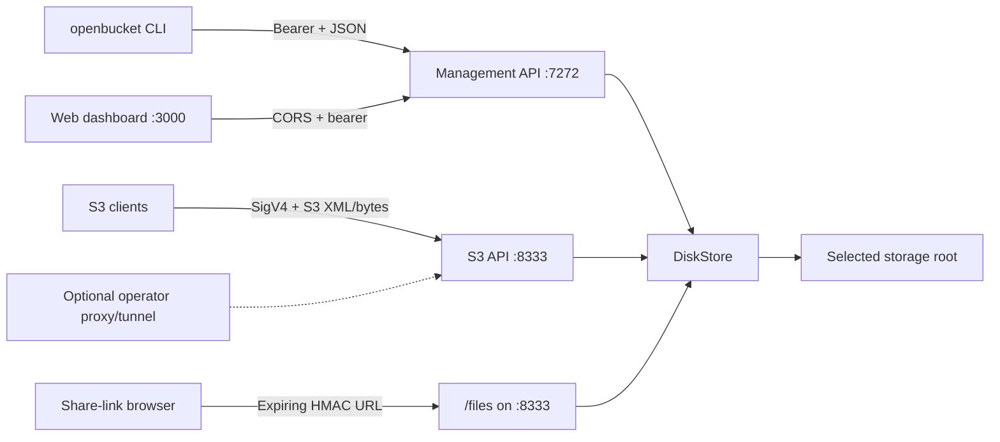

# OpenBucket product plan

Status: implementation-backed v0.1 plan
Updated: 2026-07-16

## Product thesis

Storage hardware is abundant, but applications increasingly assume a cloud object API. OpenBucket makes a folder, disk, SSD, or mounted NAS useful to that ecosystem without first moving the bytes into somebody else's hosted storage account.

The product is a local-first storage node:

- one daemon owns a selected root and exposes S3 plus a management API;
- one CLI installs, starts, inspects, and controls the node;
- one web dashboard makes the node understandable to an operator;
- standard S3 clients move real bytes directly to and from that node;
- public access, when desired, uses an explicit opt-in supervised Quick Tunnel for development or a stable reverse proxy/named tunnel the operator controls.

OpenBucket is not trying to disguise a single disk as an infinitely durable cloud. Its value is a clean, familiar interface and explicit operational truth.

## Vision

Any storage an operator can mount should become a useful, inspectable object-storage node in minutes. The long-term product should let individuals and small teams keep control of their bytes while retaining the SDKs, tools, and workflows built around S3.

Success means an operator can point OpenBucket at a real path, connect an existing S3 client, observe every request, back up and recover the node, and understand exactly which durability and security guarantees they do and do not have.

## Target users and jobs

### Local developer

Job: obtain a persistent S3-like endpoint without Docker-heavy cloud emulators or a hosted account.

Needs:

- one command and predictable local ports;
- compatibility with AWS SDKs, boto3, AWS CLI, backup tools, and test fixtures;
- disposable or persistent roots;
- deterministic errors and fast tests.

### Homelab and NAS operator

Job: expose a mounted disk or NAS share to trusted applications using S3 conventions.

Needs:

- foreground/background operation and container deployment;
- disk capacity, object counts, logs, and health;
- scoped credentials and private-by-default buckets;
- clear backup, upgrade, and failure procedures.

### Creative or technical small team

Job: share large assets from owned storage while keeping application integrations simple.

Needs:

- browser uploads/downloads and time-limited links;
- per-workload credentials;
- a comprehensible dashboard;
- an honest path to TLS and remote access.

### Edge or field operator

Job: continue producing and consuming objects on a machine with intermittent connectivity.

Needs:

- no mandatory cloud control plane;
- local API availability;
- eventual backup/export mechanisms;
- recovery tooling that does not depend on a vendor service.

### Not an initial target

Regulated, adversarial, multi-tenant, high-availability, or exabyte-scale workloads are outside the v0.x promise. Those users require audited identity, encryption/key management, redundancy, quotas, policy engines, immutable audit, and support guarantees that the current product does not provide.

## Value proposition

| Alternative | OpenBucket advantage | Tradeoff |
| --- | --- | --- |
| Hosted S3 | Data remains on operator-controlled storage; no mandatory account or egress path | Operator owns uptime, backup, TLS, and hardware failure |
| Copying files over SMB/NFS | S3 clients and presigned-style workflows can be reused | S3 compatibility is partial and adds daemon state |
| Full distributed object store | Smaller operational footprint and direct on-disk layout | No replication, erasure coding, clustering, or failover |
| Test-only S3 emulator | Persistent real bytes, management UI, keys, logs, and sharing | A production hardening program is still required |

## Product principles

1. **Local-first, cloud-optional.** Core read/write operation never depends on an OpenBucket-hosted service.
2. **Real bytes, honest metrics.** UI and APIs derive data from the selected filesystem and handled requests; demos must not ship fake operational data.
3. **Safe defaults.** Loopback listeners, private buckets, generated secrets, confined paths, and explicit public exposure.
4. **Standard edge, simple core.** Meet useful S3 conventions without pretending to implement all of AWS S3.
5. **Headless before desktop.** Daemon, CLI, APIs, dashboard, packaging, tests, and operations mature before a signed desktop shell.
6. **Recoverability over cleverness.** Data layout, state migrations, backup, restore, and integrity checks take priority over cosmetic features.
7. **No invisible hosted dependency.** Quick Tunnel mode is explicit and provider-backed; a stable reverse proxy, named tunnel, DNS, or hosted relay is named as a separate operator-controlled component.
8. **Observable failure.** Health, exit codes, structured API errors, logs, and documented recovery are product features.

## Implemented v0.1 scope

The repository currently implements:

- disk-backed buckets and objects under a selected root;
- protected `.openbucket` state, request log, temporary uploads, multipart data, and a single-writer lock;
- foreground and detached CLI lifecycle;
- automatically served local production dashboard when the built bundle is present, with a separate dashboard deployment option;
- management status, client config, bucket/object/key/share/log/analytics/stop endpoints;
- path-style SigV4 S3 authentication, presigned query authentication, public object reads, ranges, copy, and basic multipart;
- read-only and bucket-scoped credentials;
- Docker daemon/dashboard targets and Compose deployment;
- unit/integration/rendered-dashboard tests and user/operations documentation.

The implementation does not include a managed relay, account service, DNS, certificates, npm publication, OS service registration, replication, or desktop app.

## MVP acceptance criteria

The first distributable MVP is accepted only when all blocking criteria pass.

### Start and lifecycle

- [x] A user can select an absolute or relative storage root and start in foreground or detached mode.
- [x] The CLI waits for health before reporting detached startup success.
- [x] Status, logs, doctor, stop, and stable exit codes are available.
- [x] One active writer is enforced per storage root.
- [x] A built local dashboard can launch with and stop with the daemon.
- [ ] Linux systemd, macOS launchd, and Windows service recipes are validated and release-supported.

### Data path

- [x] Bucket creation writes a real directory; object upload writes the original bytes beneath it.
- [x] Restart preserves node identity, credentials, buckets, and objects.
- [x] Traversal, reserved metadata paths, unsafe key segments, and symlink escapes are rejected.
- [x] Disk-full and permission failures become structured errors.
- [ ] Crash-consistent state recovery and orphan temporary/multipart cleanup are specified and tested.
- [ ] A supported integrity scan can compare state, paths, size, and hashes.

### Client compatibility

- [x] A signed AWS SDK-style client can list, create, put, get, head, copy, range-read, delete, and complete multipart uploads.
- [x] Header SigV4 tampering, expired/skewed requests, invalid payload hashes, and unknown keys are rejected.
- [x] Path-style configuration examples exist for JavaScript, Python, AWS CLI, and management curl.
- [ ] A versioned conformance suite runs against named versions of major SDKs and backup applications.

### Control and security

- [x] CLI-managed management APIs receive a bearer token and default to loopback.
- [x] Credentials can be all-bucket or bucket-scoped and read/write or read-only.
- [x] Private is the bucket default; public means anonymous known-object reads only.
- [x] Expiring share links bind bucket, key, and expiry and expire within seven days.
- [x] Request logs redact share tokens and S3 signatures in query strings.
- [x] Automatically opened dashboards receive the management bearer in a URL fragment and retain it only in API-scoped session storage.
- [x] Opt-in Quick Tunnel mode supervises real S3, management, and local-dashboard HTTPS tunnels, advertises their live URLs, and tears them down with the daemon.
- [ ] Long-lived bearer launch is replaced or augmented with a short-lived cryptographic pairing/session protocol before broad remote-management claims.
- [ ] Independent security review and dependency/container scanning gate a stable release.

### Operator experience

- [x] Dashboard views are backed by live daemon APIs rather than fixtures.
- [x] Capacity, object counts, request counts, transfer bytes, latency, and errors are derived from disk/logs.
- [x] Docker and source workflows have health checks and documented persistence.
- [ ] Backup/restore, upgrade, downgrade, corrupt-state, disk-full, and power-loss drills pass on Linux, macOS, and Windows.

### Release

- [x] Apache-2.0 license, package manifest, README, API/security/operations docs, and examples exist.
- [ ] CI publishes checksums, an SBOM, provenance, changelog, npm package, and signed container images.
- [ ] Ownership of package names and `openbucket.dev` DNS is verified before documentation advertises live availability.

## Architecture at a glance

The CLI active-state directory is separate from the storage root. It lets CLI commands locate and authenticate to one active daemon. The authoritative node catalog, S3 secrets, and share secret live inside the storage root so the node can be restored with its data.

See [ARCHITECTURE.md](ARCHITECTURE.md) for flows, trust boundaries, state format, API ownership, and failure behavior.

## Delivery phases

### Phase 0 — working vertical slice (implemented)

Goal: prove a real local root can be controlled through CLI, dashboard, management API, useful S3 operations, and an opt-in temporary public HTTPS path.

Exit evidence: repository tests, source build, direct disk verification, and the end-to-end demo.

### Phase 1 — distributable local product

Goal: make installation, upgrade, and day-two operation boring on the three desktop/server operating systems.

Work:

- CI matrix for supported Node/OS versions;
- npm ownership and release pipeline;
- multi-architecture signed container images;
- service-manager recipes and uninstall paths;
- state schema migration framework;
- bounded log rotation and multipart/temp cleanup;
- backup/restore and integrity-check commands;
- release notes, compatibility policy, and telemetry-free update check design.

Gate: restore drills and upgrade/downgrade policy pass before `1.0` consideration.

### Phase 2 — compatibility and safety

Goal: support common SDK and backup workloads with a measurable contract.

Work:

- automated AWS SDK v3, boto3, AWS CLI, rclone, restic, and selected application tests;
- content type and custom metadata persistence;
- conditional requests and checksums;
- delimiter/common-prefix listing and robust opaque pagination;
- multipart list/resume, lifecycle, and abandoned upload management;
- quotas, rate limits, request size policy, and metrics export;
- cryptographic dashboard pairing and remote-management posture;
- external security review and threat-model update.

### Phase 3 — optional connectivity

Goal: make remote access understandable without making it mandatory.

Work:

- first-party reverse-proxy deployment profiles;
- production named-tunnel provisioning and policy integration beyond the implemented supervised Quick Tunnel demo mode;
- optional node registry and relay as a separate deployable service;
- short-lived operator sessions, device enrollment, and revocation;
- notifications and external monitoring hooks.

The core daemon remains usable with all hosted components absent.

### Phase 4 — durability expansion

Goal: add stronger durability modes without corrupting the simplicity of a single local node.

Research and gated work:

- peer-to-peer or hub replication;
- content verification/scrubbing;
- snapshots and immutable retention integration;
- object versioning;
- encrypted-at-rest managed volumes or envelope encryption;
- placement, conflict, and recovery semantics.

No “high availability” claim is made until failure injection and recovery objectives are measured.

### Phase 5 — desktop application (explicitly later)

Goal: package the mature headless product in a signed desktop experience.

Candidate scope:

- install/update/uninstall;
- folder and removable-drive selection;
- daemon lifecycle and tray state;
- secure credential storage using OS facilities;
- local dashboard shell;
- firewall/service prompts with explicit consent;
- diagnostics bundle with secret redaction.

The desktop app does not fork storage logic. It remains a client/supervisor of the same daemon and APIs. It begins only after Phase 1 stability and Phase 2 security pairing are complete.

## Metrics and instrumentation

### Activation

- Time from install to healthy daemon.
- Time from healthy daemon to first created bucket.
- Time to first successful SDK upload and verified download.
- Percentage of starts that require manual port or permission repair.

### Reliability

- Clean start/stop success rate.
- Unexpected exit rate per node-day.
- Error rates by stable error code.
- Restore drill success and median recovery time.
- Integrity-scan mismatch rate.
- Orphan temp/multipart bytes and age.

### Compatibility

- Passing operations per SDK/client/version in the conformance matrix.
- Support incidents classified as unsupported operation versus defect.
- Percentage of S3 requests returning `MethodNotAllowed`/`NotImplemented`.

### Performance

- Throughput and p50/p95/p99 latency by operation and object-size band.
- CPU and memory at idle, small-object load, sequential large-object load, and multipart load.
- Management status/list latency as object counts grow.

### Product quality

- `doctor` resolution rate.
- Documentation demo completion rate in release testing.
- Upgrade and rollback success across supported versions.
- Security patch time and dependency age.

No usage telemetry should leave a node by default. Product analytics require explicit opt-in, a published schema, retention controls, and an offline-safe product.

## Major risks and mitigations

| Risk | Impact | Mitigation / gate |
| --- | --- | --- |
| Users assume cloud durability | Irrecoverable loss after disk failure | Prominent single-node language, backup checks, restore drills, no durability marketing without evidence |
| Partial S3 behavior surprises clients | Failed or subtly incorrect workloads | Versioned matrix, conformance tests, explicit unsupported errors, client recipes |
| Plaintext secrets in node state | Credential compromise through root/backup access | Filesystem encryption/ACL guidance, secret rotation, future protected secret store/envelope encryption |
| Long-lived management bearer crosses a browser launch/session boundary | Token exposure grants full management | Fragment rather than query, immediate URL cleanup, API-scoped session storage, loopback default; future short-lived pairing |
| State JSON corruption or incompatible upgrade | Node cannot start or loses catalog | Atomic writes, schema migrations, backups, recovery validator, tested rollback policy |
| Unbounded logs and abandoned uploads | Disk exhaustion | Rotation/retention and garbage collection in Phase 1 |
| NAS/remote filesystem locking semantics differ | Split writer or partial writes | Supported-filesystem matrix, lock tests, warnings, document unsupported filesystems |
| Public URL implies cloud durability or stable hosted routing | False security/reliability expectations | Mark Quick Tunnel as ephemeral development infrastructure; treat manual URLs as advertisement only; keep proxy/tunnel health ownership explicit |
| Package/domain name is unavailable | Broken install/brand experience | Verify ownership before release; keep names and URLs configurable |
| Desktop work distracts from storage reliability | Polished wrapper around fragile core | Explicit Phase 5 gate |

## Business model guardrails

OpenBucket can sustain an open core without making local data hostage to a service.

Potential paid value:

- support and tested long-term-support releases;
- enterprise packaging, fleet policy, compliance reports, and managed updates;
- an optional hosted node registry/relay with clear data-path behavior;
- managed backup destinations or replication coordination;
- hardware/appliance partnerships.

Core commitments:

- local daemon, CLI, documented APIs, useful S3 data path, and local dashboard remain open source;
- no required account, license server, or hosted heartbeat for local operation;
- export and recovery remain possible without a subscription;
- hosted services are separately named and documented, never implied by `OPENBUCKET_PUBLIC_BASE_URL`;
- pricing must reflect service/support value, not artificial local feature breakage.

## Open-source strategy

- Apache-2.0 provides permissive use with an explicit patent grant.
- Public compatibility matrix, security policy, roadmap, and stable error/API contracts reduce operator risk.
- Contributions require tests for changed behavior and documentation for user-visible changes.
- Governance starts maintainer-led; decision records and a published release process should precede broader governance claims.
- Security disclosures need a private channel before a public tracker is promoted.
- Trademark policy should distinguish compatible forks from official releases without restricting truthful use.

## Roadmap summary

| Horizon | Outcome | Evidence required |
| --- | --- | --- |
| Now | Working local daemon/CLI/dashboard/S3 vertical slice | Build, tests, real disk demo |
| Next | Reliable install, service lifecycle, migrations, backup, cleanup | Cross-platform CI and recovery drills |
| Then | Broader S3 compatibility and stronger security controls | Client conformance and security review |
| Later | Optional remote registry/relay and durability modes | Explicit protocols and failure testing |
| Last | Signed desktop experience | Stable headless APIs and pairing model |

This order is intentional: a desktop shell is not a substitute for a durable, secure storage process.
